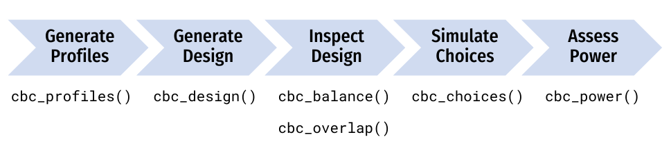

<!-- README.md is generated from README.Rmd. Please edit that file -->

```{r, include = FALSE}
knitr::opts_chunk$set(
  collapse = TRUE,
  warning = FALSE,
  message = FALSE,
  comment = "#>",
  fig.path = "man/figures/README-",
  fig.retina = 3
)
```

# cbcTools <a href='https://jhelvy.github.io/cbcTools/'></a>

<!-- badges: start -->
[](https://CRAN.R-project.org/package=cbcTools)
[](https://cran.r-project.org/package=cbcTools)
<!-- badges: end -->

This package provides functions for designing surveys and conducting power analyses for choice-based conjoint survey experiments in R. Each function in the package begins with `cbc_` and supports a step in the following process for designing and analyzing surveys:



# Installation

You can install the latest version of {cbcTools} from CRAN:

```r
install.packages("cbcTools")
```

or you can install the development version of {cbcTools} from [GitHub](https://github.com/jhelvy/cbcTools):

```r
# install.packages("pak")
pak::pak("jhelvy/cbcTools")
```

Load the package with:

```{r, eval=FALSE}
library(cbcTools)
```

# Author, Version, and License Information

- Author: *John Paul Helveston* https://www.jhelvy.com/
- Date First Written: *October 23, 2020*
- License: [MIT](https://github.com/jhelvy/cbcTools/blob/master/LICENSE.md)

# Citation Information

If you use this package for in a publication, I would greatly appreciate it if you cited it - you can get the citation by typing `citation("cbcTools")` into R:

```{r}
citation("cbcTools")
```
