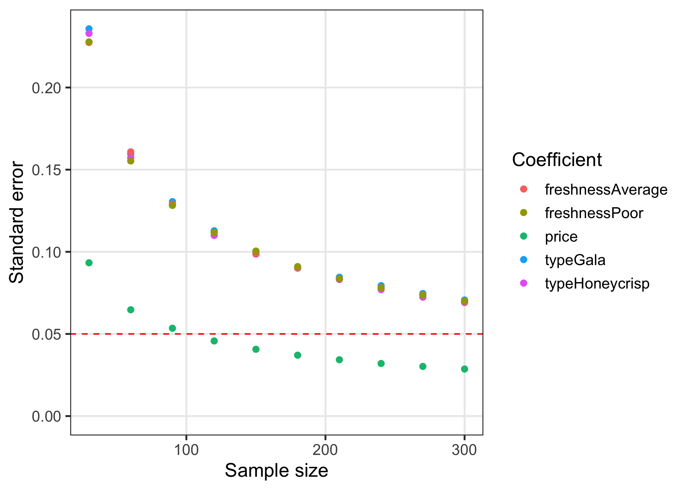

<!-- README.md is generated from README.Rmd. Please edit that file -->

# cbcTools <a href='https://jhelvy.github.io/cbcTools/'></a>

<!-- badges: start -->

[](https://CRAN.R-project.org/package=cbcTools)
<!-- badges: end -->

This package provides a set of tools for designing surveys and
conducting power analyses for choice-based conjoint survey experiments
in R. Each function in the package begins with `cbc_` and supports a
step in the following process for designing and analyzing surveys:

!()\[man/figures/process.png\]

## Installation

The current version is not yet on CRAN, but you can install it from
Github using the {remotes} library:

``` r
# install.packages("remotes")
remotes::install_github("jhelvy/cbcTools")
```

Load the library with:

``` r
library(cbcTools)
```

## Make survey designs

### Generating profiles

The first step in designing an experiment is to define the attributes
and levels for your experiment and then generate all of the `profiles`
of each possible combination of those attributes and levels. For
example, let’s say you’re designing a conjoint experiment about apples
and you want to include `price`, `type`, and `freshness` as attributes.
You can obtain all of the possible profiles for these attributes using
the `cbc_profiles()` function:

``` r
profiles <- cbc_profiles(
  price     = seq(1, 4, 0.5), # $ per pound
  type      = c('Fuji', 'Gala', 'Honeycrisp'),
  freshness = c('Excellent', 'Average', 'Poor')
)

nrow(profiles)
#> [1] 63
head(profiles)
#>   profileID price type freshness
#> 1         1   1.0 Fuji Excellent
#> 2         2   1.5 Fuji Excellent
#> 3         3   2.0 Fuji Excellent
#> 4         4   2.5 Fuji Excellent
#> 5         5   3.0 Fuji Excellent
#> 6         6   3.5 Fuji Excellent
tail(profiles)
#>    profileID price       type freshness
#> 58        58   1.5 Honeycrisp      Poor
#> 59        59   2.0 Honeycrisp      Poor
#> 60        60   2.5 Honeycrisp      Poor
#> 61        61   3.0 Honeycrisp      Poor
#> 62        62   3.5 Honeycrisp      Poor
#> 63        63   4.0 Honeycrisp      Poor
```

Depending on the context of your survey, you may wish to eliminate or
modify some profiles before designing your conjoint survey (e.g., some
profile combinations may be illogical or unrealistic), though doing so
could significantly impact your ability to identify effects. As a
result, it is recommended that you avoid eliminating profiles if
possible.

If you do wish to set some levels conditional on those of other
attributes, you can do so by setting each level of an attribute to a
list that defines these constraints. In the example below, the `type`
attribute has constraints such that only certain price levels will be
shown for each level. In addition, for the `"Honeycrisp"` level, only
two of the three `freshness` levels are included: `"Excellent"` and
`"Average"`. Note that both the other attributes (`price` and
`freshness`) should contain all of the possible levels:

``` r
profiles <- cbc_profiles(
  price = c(1, 1.5, 2, 2.5, 3, 3.5, 4, 4.5, 5),
  freshness = c("Excellent", "Average", "Poor"),
  type = list(
    "Fuji" = list(
        price = c(2, 2.5, 3)
    ),
    "Gala" = list(
        price = c(1, 1.5, 2)
    ),
    "Honeycrisp" = list(
        price = c(2.5, 3, 3.5, 4, 4.5, 5),
        freshness = c("Excellent", "Average")
    )
  )
)

nrow(profiles)
#> [1] 30
head(profiles)
#>   profileID price freshness type
#> 1         1   2.0 Excellent Fuji
#> 2         2   2.5 Excellent Fuji
#> 3         3   3.0 Excellent Fuji
#> 4         4   2.0   Average Fuji
#> 5         5   2.5   Average Fuji
#> 6         6   3.0   Average Fuji
tail(profiles)
#>    profileID price freshness       type
#> 25        25   2.5   Average Honeycrisp
#> 26        26   3.0   Average Honeycrisp
#> 27        27   3.5   Average Honeycrisp
#> 28        28   4.0   Average Honeycrisp
#> 29        29   4.5   Average Honeycrisp
#> 30        30   5.0   Average Honeycrisp
```

When these constraints you can see that there are fewer profiles
available (only 30 compared to 63 without constraints). **WARNING:
including hard constraints in your designs can substantially reduce the
statistical power of your design, so use them cautiously and avoid them
if possible**.

### Generating random designs

Once a set of profiles is obtained, a randomized conjoint survey can
then be generated using the `cbc_design()` function:

``` r
design <- cbc_design(
  profiles = profiles,
  n_resp   = 300, # Number of respondents
  n_alts   = 3,   # Number of alternatives per question
  n_q      = 6    # Number of questions per respondent
)

dim(design)  # View dimensions
#> [1] 5400    8
head(design) # Preview first 6 rows
#>   respID qID altID obsID profileID price       type freshness
#> 1      1   1     1     1        10   2.0       Gala Excellent
#> 2      1   1     2     1        30   1.5       Gala   Average
#> 3      1   1     3     1        43   1.0       Fuji      Poor
#> 4      1   2     1     2        21   4.0 Honeycrisp Excellent
#> 5      1   2     2     2        14   4.0       Gala Excellent
#> 6      1   2     3     2         3   2.0       Fuji Excellent
```

For now, the `cbc_design()` function only generates a randomized design.
Other packages, such as the [{idefix}](https://github.com/traets/idefix)
package, are able to generate other types of designs, such as
D-efficient designs. The randomized design simply samples from the set
of `profiles`. It also ensures that no two alternatives are the same in
any choice question.

The resulting `design` data frame includes the following columns:

-   `respID`: Identifies each survey respondent.
-   `qID`: Identifies the choice question answered by the respondent.
-   `altID`:Identifies the alternative in any one choice observation.
-   `obsID`: Identifies each unique choice observation across all
    respondents.
-   `profileID`: Identifies the profile in `profiles`.

### Labeled designs (a.k.a. “alternative-specific” designs)

You can also make a “labeled” design (also known as
“alternative-specific” design) where the levels of one attribute is used
as a label by setting the `label` argument to that attribute. This by
definition sets the number of alternatives in each question to the
number of levels in the chosen attribute, so the `n_alts` argument is
overridden. Here is an example labeled survey using the `type` attribute
as the label:

``` r
design_labeled <- cbc_design(
  profiles  = profiles,
  n_resp    = 300, # Number of respondents
  n_alts    = 3,   # Number of alternatives per question
  n_q       = 6,   # Number of questions per respondent
  label     = "type" # Set the "type" attribute as the label
)

dim(design_labeled)
#> [1] 5400    8
head(design_labeled)
#>   respID qID altID obsID profileID price       type freshness
#> 1      1   1     1     1        48   3.5       Fuji      Poor
#> 2      1   1     2     1        14   4.0       Gala Excellent
#> 3      1   1     3     1        17   2.0 Honeycrisp Excellent
#> 4      1   2     1     2         5   3.0       Fuji Excellent
#> 5      1   2     2     2        31   2.0       Gala   Average
#> 6      1   2     3     2        61   3.0 Honeycrisp      Poor
```

In the above example, you can see in the first six rows of the survey
that the `type` attribute is always fixed to be the same order, ensuring
that each level in the `type` attribute will always be shown in each
choice question.

### Adding a “no choice” option (a.k.a. “outside good”)

You can include a “no choice” (also known as “outside good” option in
your survey by setting `no_choice = TRUE`. If included, all categorical
attributes will be dummy-coded to appropriately dummy-code the “no
choice” alternative.

``` r
design_nochoice <- cbc_design(
  profiles  = profiles,
  n_resp    = 300, # Number of respondents
  n_alts    = 3, # Number of alternatives per question
  n_q       = 6, # Number of questions per respondent
  no_choice = TRUE
)

dim(design_nochoice)
#> [1] 7200   13
head(design_nochoice)
#>   respID qID altID obsID profileID price type_Fuji type_Gala type_Honeycrisp
#> 1      1   1     1     1         6   3.5         1         0               0
#> 2      1   1     2     1        18   2.5         0         0               1
#> 3      1   1     3     1        38   2.0         0         0               1
#> 4      1   1     4     1         0   0.0         0         0               0
#> 5      1   2     1     2        47   3.0         1         0               0
#> 6      1   2     2     2        37   1.5         0         0               1
#>   freshness_Excellent freshness_Average freshness_Poor no_choice
#> 1                   1                 0              0         0
#> 2                   1                 0              0         0
#> 3                   0                 1              0         0
#> 4                   0                 0              0         1
#> 5                   0                 0              1         0
#> 6                   0                 1              0         0
```

## Inspecting survey designs

The {cbcTools} package includes some functions to quickly inspect some
basic metrics of a design.

The `cbc_balance()` function prints out a summary of the counts of each
level for each attribute across all choice questions as well as the
two-way counts across all pairs of attributes for a given design:

``` r
cbc_balance(design)
#> ==============================
#> Attribute counts:
#> 
#> price:
#> 
#>   1 1.5   2 2.5   3 3.5   4 
#> 724 794 799 782 753 798 750 
#> 
#> type:
#> 
#>       Fuji       Gala Honeycrisp 
#>       1814       1761       1825 
#> 
#> freshness:
#> 
#> Excellent   Average      Poor 
#>      1837      1788      1775 
#> 
#> ==============================
#> Pairwise attribute counts:
#> 
#> price & type:
#>      
#>       Fuji Gala Honeycrisp
#>   1    233  232        259
#>   1.5  272  260        262
#>   2    273  274        252
#>   2.5  261  252        269
#>   3    256  242        255
#>   3.5  268  251        279
#>   4    251  250        249
#> 
#> price & freshness:
#>      
#>       Excellent Average Poor
#>   1         230     251  243
#>   1.5       273     253  268
#>   2         272     260  267
#>   2.5       286     254  242
#>   3         258     254  241
#>   3.5       264     269  265
#>   4         254     247  249
#> 
#> type & freshness:
#>             
#>              Excellent Average Poor
#>   Fuji             585     614  615
#>   Gala             592     585  584
#>   Honeycrisp       660     589  576
```

The `cbc_overlap()` function prints out a summary of the amount of
“overlap” across attributes within the choice questions. For example,
for each attribute, the count under `"1"` is the number of choice
questions in which the same level was shown across all alternatives for
that attribute (because there was only one level shown). Likewise, the
count under `"2"` is the number of choice questions in which only two
unique levels of that attribute were shown, and so on:

``` r
cbc_overlap(design)
#> ==============================
#> Counts of attribute overlap:
#> (# of questions with N unique levels)
#> 
#> price:
#> 
#>    1    2    3 
#>   25  616 1159 
#> 
#> type:
#> 
#>    1    2    3 
#>  158 1228  414 
#> 
#> freshness:
#> 
#>    1    2    3 
#>  182 1216  402
```

## Simulating choices

You can simulate choices for a given `design` using the `cbc_choices()`
function. By default, random choices are simulated:

``` r
data <- cbc_choices(
  design = design,
  obsID  = "obsID"
)

head(data)
#>   respID qID altID obsID profileID price       type freshness choice
#> 1      1   1     1     1        10   2.0       Gala Excellent      0
#> 2      1   1     2     1        30   1.5       Gala   Average      1
#> 3      1   1     3     1        43   1.0       Fuji      Poor      0
#> 4      1   2     1     2        21   4.0 Honeycrisp Excellent      0
#> 5      1   2     2     2        14   4.0       Gala Excellent      0
#> 6      1   2     3     2         3   2.0       Fuji Excellent      1
```

You can also pass a list of prior parameters to define a utility model
that will be used to simulate choices. In the example below, the choices
are simulated using a utility model with the following parameters:

-   1 continuous parameter for `price`
-   2 categorical parameters for `type` (first level is reference)
-   2 categorical parameters for `freshness` (first level is reference)

``` r
data <- cbc_choices(
  design = design,
  obsID = "obsID",
  priors = list(
    price     = 0.1,
    type      = c(0.1, 0.2),
    freshness = c(0.1, -0.2)
  )
)
```

If you wish to include a prior model with an interaction, you can do so
inside the `priors` list. For example, here is the same example as above
but with an interaction between `price` and `type` added:

``` r
data <- cbc_choices(
  design = design,
  obsID = "obsID",
  priors = list(
    price = 0.1,
    type = c(0.1, 0.2),
    freshness = c(0.1, -0.2),
    `price*type` = c(0.1, 0.5)
  )
)
```

Finally, you can also simulate data for a mixed logit specification
where parameters follow a normal or log-normal distribution across the
population. In the example below, the `randN()` function is used to
specify the `type` attribute with 2 random normal discrete parameters
with a specified mean (`mu`) and standard deviation (`sigma`):

``` r
data <- cbc_choices(
  design = design,
  obsID = "obsID",
  priors = list(
    price = 0.1,
    type = randN(mu = c(0.1, 0.2), sigma = c(0.5, 1)),
    freshness = c(0.1, -0.2)
  )
)
```

## Conducting a power analysis

The simulated choice data can be used to conduct a power analysis by
estimating the same model multiple times with incrementally increasing
sample sizes. As the sample size increases, the estimated coefficient
standard errors should decrease (i.e. coefficient estimates become more
precise). The `cbc_power()` function achieves this by partitioning the
choice data into multiple sizes (defined by the `nbreaks` argument) and
then estimating a user-defined choice model on each data subset. In the
example below, 10 different sample sizes are used. All models are
estimated using the [{logitr}](https://jhelvy.github.io/logitr) package:

``` r
results <- cbc_power(
  data    = data,
  pars    = c("price", "type", "freshness"),
  outcome = "choice",
  obsID   = "obsID",
  nbreaks = 10,
  n_q     = 6
)

head(results)
#>   sampleSize             coef          est         se
#> 1         30            price -0.003496871 0.09075320
#> 2         30         typeGala -0.107772895 0.22341468
#> 3         30   typeHoneycrisp  0.223392471 0.21903106
#> 4         30 freshnessAverage -0.018088982 0.22853611
#> 5         30    freshnessPoor  0.047667302 0.21473040
#> 6         60            price  0.035007108 0.06526043
tail(results)
#>    sampleSize             coef          est         se
#> 45        270    freshnessPoor  0.030058873 0.07405703
#> 46        300            price  0.033320430 0.02907289
#> 47        300         typeGala  0.044571885 0.06980725
#> 48        300   typeHoneycrisp -0.074113825 0.06954693
#> 49        300 freshnessAverage  0.010923880 0.07039688
#> 50        300    freshnessPoor -0.006226523 0.07023654
```

The `results` object is a data frame containing the coefficient
estimates and standard errors for each sample size. You can quickly
visualize the outcome to identify a required sample size for a desired
level of parameter precision by using the `plot()` method:

``` r
plot(results)
```



## Piping it all together!

One of the convenient features of how the package is written is that the
object generated in each step is used as the first argument to the
function for the next step. Thus, just like in the overall program
diagram, the functions can be piped together:


``` r
cbc_profiles(
  price     = seq(1, 4, 0.5), # $ per pound
  type      = c('Fuji', 'Gala', 'Honeycrisp'),
  freshness = c('Excellent', 'Average', 'Poor')
) |>
cbc_design(
  n_resp   = 300, # Number of respondents
  n_alts   = 3,   # Number of alternatives per question
  n_q      = 6    # Number of questions per respondent
) |>
cbc_choices(
  obsID = "obsID",
  priors = list(
    price     = 0.1,
    type      = c(0.1, 0.2),
    freshness = c(0.1, -0.2)
  )
) |>
cbc_power(
    pars    = c("price", "type", "freshness"),
    outcome = "choice",
    obsID   = "obsID",
    nbreaks = 10,
    n_q     = 6
) |>
plot()
```


## Author, Version, and License Information

-   Author: *John Paul Helveston* <https://www.jhelvy.com/>
-   Date First Written: *October 23, 2020*
-   License:
    [MIT](https://github.com/jhelvy/cbcTools/blob/master/LICENSE.md)

## Citation Information

If you use this package for in a publication, I would greatly appreciate
it if you cited it - you can get the citation by typing
`citation("cbcTools")` into R:

``` r
citation("cbcTools")
#> 
#> To cite cbcTools in publications use:
#> 
#>   John Paul Helveston (2022). cbcTools: Tools For Designing Conjoint
#>   Survey Experiments.
#> 
#> A BibTeX entry for LaTeX users is
#> 
#>   @Manual{,
#>     title = {cbcTools: Tools For Designing Choice-Based Conjoint Survey Experiments},
#>     author = {John Paul Helveston},
#>     year = {2022},
#>     note = {R package version 0.0.2},
#>     url = {https://jhelvy.github.io/cbcTools/},
#>   }
```
