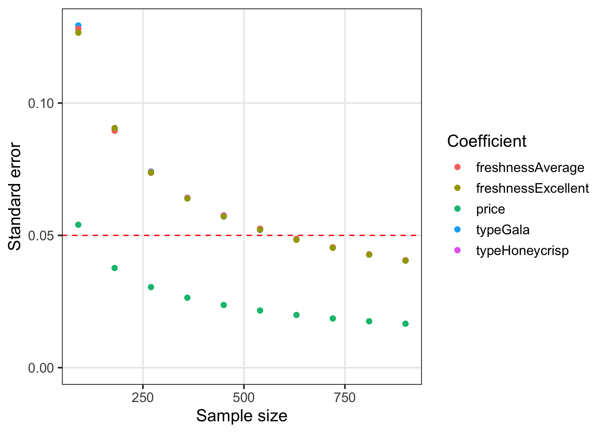

<!-- README.md is generated from README.Rmd. Please edit that file -->

# cbcTools <a href='https://jhelvy.github.io/cbcTools/'></a>

<!-- badges: start -->

[](https://CRAN.R-project.org/package=cbcTools)
<!-- badges: end -->

This package provides a set of tools for designing surveys and
conducting power analyses for choice-based conjoint survey experiments
in R. Each function in the package begins with `cbc_` and supports a
step in the following process for designing and analyzing surveys:


## Installation

The current version is not yet on CRAN, but you can install it from
Github using the {remotes} library:

``` r
# install.packages("remotes")
remotes::install_github("jhelvy/cbcTools")
```

Load the library with:

``` r
library(cbcTools)
```

## Make survey designs

### Generating profiles

The first step in designing an experiment is to define the attributes
and levels for your experiment and then generate all of the `profiles`
of each possible combination of those attributes and levels. For
example, let’s say you’re designing a conjoint experiment about apples
and you want to include `price`, `type`, and `freshness` as attributes.
You can obtain all of the possible profiles for these attributes using
the `cbc_profiles()` function:

``` r
profiles <- cbc_profiles(
  price     = seq(1, 4, 0.5), # $ per pound
  type      = c('Fuji', 'Gala', 'Honeycrisp'),
  freshness = c('Poor', 'Average', 'Excellent')
)

nrow(profiles)
#> [1] 63
head(profiles)
#>   profileID price type freshness
#> 1         1   1.0 Fuji      Poor
#> 2         2   1.5 Fuji      Poor
#> 3         3   2.0 Fuji      Poor
#> 4         4   2.5 Fuji      Poor
#> 5         5   3.0 Fuji      Poor
#> 6         6   3.5 Fuji      Poor
tail(profiles)
#>    profileID price       type freshness
#> 58        58   1.5 Honeycrisp Excellent
#> 59        59   2.0 Honeycrisp Excellent
#> 60        60   2.5 Honeycrisp Excellent
#> 61        61   3.0 Honeycrisp Excellent
#> 62        62   3.5 Honeycrisp Excellent
#> 63        63   4.0 Honeycrisp Excellent
```

Depending on the context of your survey, you may wish to eliminate or
modify some profiles before designing your conjoint survey (e.g., some
profile combinations may be illogical or unrealistic). **WARNING:
including hard constraints in your designs can substantially reduce the
statistical power of your design, so use them cautiously and avoid them
if possible**.

If you do wish to set some levels conditional on those of other
attributes, you can do so by setting each level of an attribute to a
list that defines these constraints. In the example below, the `type`
attribute has constraints such that only certain price levels will be
shown for each level. In addition, for the `"Honeycrisp"` level, only
two of the three `freshness` levels are included: `"Excellent"` and
`"Average"`. Note that both the other attributes (`price` and
`freshness`) should contain all of the possible levels. When these
constraints you can see that there are only 30 profiles compared to 63
without constraints:

``` r
profiles <- cbc_profiles(
  price = c(1, 1.5, 2, 2.5, 3, 3.5, 4, 4.5, 5),
  freshness = c('Poor', 'Average', 'Excellent'),
  type = list(
    "Fuji" = list(
        price = c(2, 2.5, 3)
    ),
    "Gala" = list(
        price = c(1, 1.5, 2)
    ),
    "Honeycrisp" = list(
        price = c(2.5, 3, 3.5, 4, 4.5, 5),
        freshness = c("Average", "Excellent")
    )
  )
)

nrow(profiles)
#> [1] 30
head(profiles)
#>   profileID price freshness type
#> 1         1   2.0      Poor Fuji
#> 2         2   2.5      Poor Fuji
#> 3         3   3.0      Poor Fuji
#> 4         4   2.0   Average Fuji
#> 5         5   2.5   Average Fuji
#> 6         6   3.0   Average Fuji
tail(profiles)
#>    profileID price freshness       type
#> 25        25   2.5 Excellent Honeycrisp
#> 26        26   3.0 Excellent Honeycrisp
#> 27        27   3.5 Excellent Honeycrisp
#> 28        28   4.0 Excellent Honeycrisp
#> 29        29   4.5 Excellent Honeycrisp
#> 30        30   5.0 Excellent Honeycrisp
```

### Generating random designs

Once a set of profiles is obtained, a randomized conjoint survey can
then be generated using the `cbc_design()` function:

``` r
design <- cbc_design(
  profiles = profiles,
  n_resp   = 900, # Number of respondents
  n_alts   = 3,   # Number of alternatives per question
  n_q      = 6    # Number of questions per respondent
)

dim(design)  # View dimensions
#> [1] 16200     8
head(design) # Preview first 6 rows
#>   profileID respID qID altID obsID price       type freshness
#> 1        13      1   1     1     1   3.5       Gala      Poor
#> 2        46      1   1     2     1   2.5       Fuji Excellent
#> 3        60      1   1     3     1   2.5 Honeycrisp Excellent
#> 4        40      1   2     1     2   3.0 Honeycrisp   Average
#> 5        15      1   2     2     2   1.0 Honeycrisp      Poor
#> 6         1      1   2     3     2   1.0       Fuji      Poor
```

For now, the `cbc_design()` function only generates a randomized design.
Other packages, such as the [{idefix}](https://github.com/traets/idefix)
package, are able to generate other types of designs, such as Bayesian
D-efficient designs. The randomized design simply samples from the set
of `profiles`. It also ensures that no two profiles are the same in any
choice question.

The resulting `design` data frame includes the following columns:

-   `respID`: Identifies each survey respondent.
-   `qID`: Identifies the choice question answered by the respondent.
-   `altID`:Identifies the alternative in any one choice observation.
-   `obsID`: Identifies each unique choice observation across all
    respondents.
-   `profileID`: Identifies the profile in `profiles`.

### Labeled designs (a.k.a. “alternative-specific” designs)

You can also make a “labeled” design (also known as
“alternative-specific” design) where the levels of one attribute is used
as a label by setting the `label` argument to that attribute. This by
definition sets the number of alternatives in each question to the
number of levels in the chosen attribute, so the `n_alts` argument is
overridden. Here is an example labeled survey using the `type` attribute
as the label:

``` r
design_labeled <- cbc_design(
  profiles  = profiles,
  n_resp    = 900, # Number of respondents
  n_alts    = 3,   # Number of alternatives per question
  n_q       = 6,   # Number of questions per respondent
  label     = "type" # Set the "type" attribute as the label
)

dim(design_labeled)
#> [1] 16200     8
head(design_labeled)
#>   profileID respID qID altID obsID price       type freshness
#> 1         2      1   1     1     1   1.5       Fuji      Poor
#> 2        32      1   1     2     1   2.5       Gala   Average
#> 3        15      1   1     3     1   1.0 Honeycrisp      Poor
#> 4         6      1   2     1     2   3.5       Fuji      Poor
#> 5        31      1   2     2     2   2.0       Gala   Average
#> 6        59      1   2     3     2   2.0 Honeycrisp Excellent
```

In the above example, you can see in the first six rows of the survey
that the `type` attribute is always fixed to be the same order, ensuring
that each level in the `type` attribute will always be shown in each
choice question.

### Adding a “no choice” option (a.k.a. “outside good”)

You can include a “no choice” (also known as “outside good”) option in
your survey by setting `no_choice = TRUE`. If included, all categorical
attributes will be dummy-coded to appropriately dummy-code the “no
choice” alternative.

``` r
design_nochoice <- cbc_design(
  profiles  = profiles,
  n_resp    = 900, # Number of respondents
  n_alts    = 3, # Number of alternatives per question
  n_q       = 6, # Number of questions per respondent
  no_choice = TRUE
)

dim(design_nochoice)
#> [1] 21600    13
head(design_nochoice)
#>   profileID respID qID altID obsID price type_Fuji type_Gala type_Honeycrisp
#> 1        50      1   1     1     1   1.0         0         1               0
#> 2        43      1   1     2     1   1.0         1         0               0
#> 3        37      1   1     3     1   1.5         0         0               1
#> 4         0      1   1     4     1   0.0         0         0               0
#> 5        49      1   2     1     2   4.0         1         0               0
#> 6        37      1   2     2     2   1.5         0         0               1
#>   freshness_Poor freshness_Average freshness_Excellent no_choice
#> 1              0                 0                   1         0
#> 2              0                 0                   1         0
#> 3              0                 1                   0         0
#> 4              0                 0                   0         1
#> 5              0                 0                   1         0
#> 6              0                 1                   0         0
```

### Bayesian D-Efficient designs

A Bayesian D-Efficient design can be obtained by providing a list of
prior parameters to define an expected prior utility model. These
designs are optimized to minimize the D-error of the design given a
prior model. The optimization is handled using the [{idefix}
package](https://www.jstatsoft.org/article/view/v096i03), which provides
even more flexible designs.

In the example below, the prior model assumes the following parameters:

-   1 continuous parameter for `price`
-   2 categorical parameters for `type` (`'Gala'` and `'Honeycrisp'`)
-   2 categorical parameters for `freshness` (`"Average"` and
    `"Excellent"`)

``` r
design_db_eff <- cbc_design(
  profiles  = profiles,
  n_resp    = 900, # Number of respondents
  n_alts    = 3, # Number of alternatives per question
  n_q       = 6, # Number of questions per respondent
  priors = list(
    price     = -0.1,
    type      = c(0.1, 0.2),
    freshness = c(0.1, 0.2)
  )
)

dim(design_db_eff)
#> [1] 16200     8
head(design_db_eff)
#>   profileID respID qID altID obsID price       type freshness
#> 1        43      1   1     1     1     1       Fuji Excellent
#> 2        50      1   1     2     1     1       Gala Excellent
#> 3         8      1   1     3     1     1       Gala      Poor
#> 4        57      1   2     1     2     1 Honeycrisp Excellent
#> 5        23      1   2     2     2   1.5       Fuji   Average
#> 6         2      1   2     3     2   1.5       Fuji      Poor
```

## Inspecting survey designs

The package includes some functions to quickly inspect some basic
metrics of a design.

The `cbc_balance()` function prints out a summary of the individual and
pairwise counts of each level of each attribute across all choice
questions:

``` r
cbc_balance(design)
#> ==============================
#> price x type 
#> 
#>          Fuji Gala Honeycrisp
#>       NA 5443 5298       5459
#> 1   2303  745  774        784
#> 1.5 2323  796  716        811
#> 2   2331  799  709        823
#> 2.5 2279  780  765        734
#> 3   2355  778  791        786
#> 3.5 2360  797  811        752
#> 4   2249  748  732        769
#> 
#> price x freshness 
#> 
#>          Poor Average Excellent
#>       NA 5430    5492      5278
#> 1   2303  776     765       762
#> 1.5 2323  756     805       762
#> 2   2331  791     774       766
#> 2.5 2279  756     785       738
#> 3   2355  811     809       735
#> 3.5 2360  816     767       777
#> 4   2249  724     787       738
#> 
#> type x freshness 
#> 
#>                 Poor Average Excellent
#>              NA 5430    5492      5278
#> Fuji       5443 1803    1894      1746
#> Gala       5298 1767    1785      1746
#> Honeycrisp 5459 1860    1813      1786
```

The `cbc_overlap()` function prints out a summary of the amount of
“overlap” across attributes within the choice questions. For example,
for each attribute, the count under `"1"` is the number of choice
questions in which the same level was shown across all alternatives for
that attribute (because there was only one level shown). Likewise, the
count under `"2"` is the number of choice questions in which only two
unique levels of that attribute were shown, and so on:

``` r
cbc_overlap(design)
#> ==============================
#> Counts of attribute overlap:
#> (# of questions with N unique levels)
#> 
#> price:
#> 
#>    1    2    3 
#>   73 1859 3468 
#> 
#> type:
#> 
#>    1    2    3 
#>  549 3611 1240 
#> 
#> freshness:
#> 
#>    1    2    3 
#>  559 3598 1243
```

## Simulating choices

You can simulate choices for a given `design` using the `cbc_choices()`
function. By default, random choices are simulated:

``` r
data <- cbc_choices(
  design = design,
  obsID  = "obsID"
)

head(data)
#>   profileID respID qID altID obsID price       type freshness choice
#> 1        13      1   1     1     1   3.5       Gala      Poor      0
#> 2        46      1   1     2     1   2.5       Fuji Excellent      0
#> 3        60      1   1     3     1   2.5 Honeycrisp Excellent      1
#> 4        40      1   2     1     2   3.0 Honeycrisp   Average      0
#> 5        15      1   2     2     2   1.0 Honeycrisp      Poor      1
#> 6         1      1   2     3     2   1.0       Fuji      Poor      0
```

You can also pass a list of prior parameters to define a utility model
that will be used to simulate choices. In the example below, the choices
are simulated using a utility model with the following parameters:

-   1 continuous parameter for `price`
-   2 categorical parameters for `type` (`'Gala'` and `'Honeycrisp'`)
-   2 categorical parameters for `freshness` (`"Average"` and
    `"Excellent"`)

Note that for categorical variables (`type` and `freshness` in this
example), the first level defined when using `cbc_profiles()` is set as
the reference level. The example below defines the following utility
model for simulating choices for each alternative *j*:

$$
u_j = -0.1price_j + 0.1typeGala_j + 0.2typeHoneycrisp_j + 0.1freshnessAverage_j + 0.2freshnessExcellent_j + \varepsilon_j
$$

``` r
data <- cbc_choices(
  design = design,
  obsID = "obsID",
  priors = list(
    price     = -0.1,
    type      = c(0.1, 0.2),
    freshness = c(0.1, 0.2)
  )
)
```

If you wish to include a prior model with an interaction, you can do so
inside the `priors` list. For example, here is the same example as above
but with an interaction between `price` and `type` added:

``` r
data <- cbc_choices(
  design = design,
  obsID = "obsID",
  priors = list(
    price = 0.1,
    type = c(0.1, 0.2),
    freshness = c(0.1, 0.2),
    `price*type` = c(0.1, 0.5)
  )
)
```

Finally, you can also simulate data for a mixed logit model where
parameters follow a normal or log-normal distribution across the
population. In the example below, the `randN()` function is used to
specify the `type` attribute with 2 random normal parameters with a
specified vector of means (`mean`) and standard deviations (`sd`) for
each level of `type`. Log-normal parameters are specified using
`randLN()`.

``` r
data <- cbc_choices(
  design = design,
  obsID = "obsID",
  priors = list(
    price = -0.1,
    type = randN(mean = c(0.1, 0.2), sd = c(1, 2)),
    freshness = c(0.1, 0.2)
  )
)
```

## Conducting a power analysis

The simulated choice data can be used to conduct a power analysis by
estimating the same model multiple times with incrementally increasing
sample sizes. As the sample size increases, the estimated coefficient
standard errors will decrease (i.e. coefficient estimates become more
precise). The `cbc_power()` function achieves this by partitioning the
choice data into multiple sizes (defined by the `nbreaks` argument) and
then estimating a user-defined choice model on each data subset. In the
example below, 10 different sample sizes are used. All models are
estimated using the [{logitr}](https://jhelvy.github.io/logitr) package:

``` r
power <- cbc_power(
  data    = data,
  pars    = c("price", "type", "freshness"),
  outcome = "choice",
  obsID   = "obsID",
  nbreaks = 10,
  n_q     = 6
)

head(power)
#>   sampleSize               coef          est         se
#> 1         90              price -0.047211522 0.05395527
#> 2         90           typeGala  0.032711772 0.13023665
#> 3         90     typeHoneycrisp  0.146116973 0.12856371
#> 4         90   freshnessAverage -0.111692807 0.13226114
#> 5         90 freshnessExcellent -0.181352943 0.12873063
#> 6        180              price  0.001894538 0.03766355
tail(power)
#>    sampleSize               coef         est         se
#> 45        810 freshnessExcellent  0.03964492 0.04302649
#> 46        900              price -0.01900892 0.01664332
#> 47        900           typeGala -0.02621508 0.04045574
#> 48        900     typeHoneycrisp -0.06018091 0.04054780
#> 49        900   freshnessAverage -0.02393608 0.04055085
#> 50        900 freshnessExcellent  0.03491236 0.04078029
```

The `power` data frame contains the coefficient estimates and standard
errors for each sample size. You can quickly visualize the outcome to
identify a required sample size for a desired level of parameter
precision by using the `plot()` method:

``` r
plot(power)
```



If you want to examine any other aspects of the models other than the
standard errors, you can set `return_models = TRUE` and `cbc_power()`
will return a list of estimated models. The example below prints a
summary of the last model in the list of models:

``` r
library(logitr)

models <- cbc_power(
  data    = data,
  pars    = c("price", "type", "freshness"),
  outcome = "choice",
  obsID   = "obsID",
  nbreaks = 10,
  n_q     = 6,
  return_models = TRUE
)

summary(models[[10]])
#> =================================================
#> 
#> Model estimated on: Mon Oct 31 11:32:51 2022 
#> 
#> Using logitr version: 0.8.0 
#> 
#> Call:
#> FUN(data = X[[i]], outcome = ..1, obsID = ..2, pars = ..3, randPars = ..4, 
#>     panelID = ..5, clusterID = ..6, robust = ..7, predict = ..8)
#> 
#> Frequencies of alternatives:
#>       1       2       3 
#> 0.33019 0.33315 0.33667 
#> 
#> Exit Status: 3, Optimization stopped because ftol_rel or ftol_abs was reached.
#>                                 
#> Model Type:    Multinomial Logit
#> Model Space:          Preference
#> Model Run:                1 of 1
#> Iterations:                    9
#> Elapsed Time:        0h:0m:0.03s
#> Algorithm:        NLOPT_LD_LBFGS
#> Weights Used?:             FALSE
#> Robust?                    FALSE
#> 
#> Model Coefficients: 
#>                     Estimate Std. Error z-value Pr(>|z|)
#> price              -0.019009   0.016643 -1.1421   0.2534
#> typeGala           -0.026215   0.040456 -0.6480   0.5170
#> typeHoneycrisp     -0.060181   0.040548 -1.4842   0.1378
#> freshnessAverage   -0.023936   0.040551 -0.5903   0.5550
#> freshnessExcellent  0.034912   0.040780  0.8561   0.3919
#>                                      
#> Log-Likelihood:         -5.929698e+03
#> Null Log-Likelihood:    -5.932506e+03
#> AIC:                     1.186940e+04
#> BIC:                     1.190237e+04
#> McFadden R2:             4.734139e-04
#> Adj McFadden R2:        -3.694002e-04
#> Number of Observations:  5.400000e+03
```

## Piping it all together!

One of the convenient features of how the package is written is that the
object generated in each step is used as the first argument to the
function for the next step. Thus, just like in the overall program
diagram, the functions can be piped together:

``` r
cbc_profiles(
  price     = seq(1, 4, 0.5), # $ per pound
  type      = c('Fuji', 'Gala', 'Honeycrisp'),
  freshness = c('Poor', 'Average', 'Excellent')
) |>
cbc_design(
  n_resp   = 900, # Number of respondents
  n_alts   = 3,   # Number of alternatives per question
  n_q      = 6    # Number of questions per respondent
) |>
cbc_choices(
  obsID = "obsID",
  priors = list(
    price     = -0.1,
    type      = c(0.1, 0.2),
    freshness = c(0.1, 0.2)
  )
) |>
cbc_power(
    pars    = c("price", "type", "freshness"),
    outcome = "choice",
    obsID   = "obsID",
    nbreaks = 10,
    n_q     = 6
) |>
plot()
```


## Author, Version, and License Information

-   Author: *John Paul Helveston* <https://www.jhelvy.com/>
-   Date First Written: *October 23, 2020*
-   License:
    [MIT](https://github.com/jhelvy/cbcTools/blob/master/LICENSE.md)

## Citation Information

If you use this package for in a publication, I would greatly appreciate
it if you cited it - you can get the citation by typing
`citation("cbcTools")` into R:

``` r
citation("cbcTools")
#> 
#> To cite cbcTools in publications use:
#> 
#>   John Paul Helveston (2022). cbcTools: Tools For Designing Conjoint
#>   Survey Experiments.
#> 
#> A BibTeX entry for LaTeX users is
#> 
#>   @Manual{,
#>     title = {cbcTools: Tools For Designing Choice-Based Conjoint Survey Experiments},
#>     author = {John Paul Helveston},
#>     year = {2022},
#>     note = {R package version 0.0.3},
#>     url = {https://jhelvy.github.io/cbcTools/},
#>   }
```
