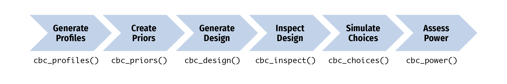

<!-- README.md is generated from README.Rmd. Please edit that file -->

# cbcTools <a href='https://jhelvy.github.io/cbcTools/'></a>

<!-- badges: start -->

[](https://CRAN.R-project.org/package=cbcTools)
[](https://cran.r-project.org/package=cbcTools)
<!-- badges: end -->

This package provides functions for generating and inspecting survey
designs for **choice-based conjoint** (CBC) survey experiments in R.
Each function in the package begins with `cbc_` and supports a step in
the following process for designing and analyzing survey experiments:

<figure>

<figcaption aria-hidden="true">Workflow diagram showing the six-step
cbcTools process: Generate Profiles (cbc_profiles) -&gt; Create Priors
(cbc_priors) -&gt; Generate Design (cbc_design) -&gt; Inspect Design
(cbc_inspect) -&gt; Simulate Choices (cbc_choices) -&gt; Assess Power
(cbc_power)</figcaption>
</figure>

After installing the package, got to the [Getting
Started](https://jhelvy.github.io/cbcTools/articles/getting-started.html)
page to learn how to use the package.

## Installation

You can install the latest version of {cbcTools} from CRAN:

``` r
install.packages("cbcTools")
```

or you can install the development version of {cbcTools} from
[GitHub](https://github.com/jhelvy/cbcTools):

``` r
# install.packages("pak")
pak::pak("jhelvy/cbcTools")
```

Load the package with:

``` r
library(cbcTools)
```

## Alternatives

The **cbcTools** package is an open-source alternative to commercial
design software such as [Ngene](https://www.choice-metrics.com/) and
Sawtooth Software. Other open-source conjoint experiment design packages
include [idefix](https://www.jstatsoft.org/article/view/v096i03) and
[spdesign](https://spdesign.edsandorf.me/).

## Author, Version, and License Information

- Author: *John Paul Helveston* <https://www.jhelvy.com/>
- Date First Written: *October 23, 2020*
- License:
  [MIT](https://github.com/jhelvy/cbcTools/blob/master/LICENSE.md)

## Citation Information

If you use this package for in a publication, I would greatly appreciate
it if you cited it - you can get the citation by typing
`citation("cbcTools")` into R:

``` r
citation("cbcTools")
#> To cite cbcTools in publications use:
#> 
#>   Helveston JP (2025). _cbcTools: Design and Analyze Choice-Based
#>   Conjoint Experiments_. R package,
#>   <https://jhelvy.github.io/cbcTools/>.
#> 
#> A BibTeX entry for LaTeX users is
#> 
#>   @Manual{,
#>     title = {{cbcTools}: Design and Analyze Choice-Based Conjoint Experiments},
#>     author = {John Paul Helveston},
#>     year = {2025},
#>     note = {R package},
#>     url = {https://jhelvy.github.io/cbcTools/},
#>   }
```
